# 项目实战：大模型AI+：金融对话交互智能系统

### 1、项目背景

本项目以大模型为核心，构建一套面向金融场景的对话式交互系统，用于回答用户提出的各类金融问题。系统数据来自真实的 11,588 份上市公司年度报告，覆盖 2019—2021 年期间披露内容。

项目目标是打造“上市公司年报深度解析”的智能对话系统。针对金融文本中大量专业术语、隐含逻辑与信息分散等特点，系统通过 AI 技术提供接近专家水准的解读与分析能力。尽管大模型在通用文本对话上已有明显进展，但落到真实金融交互场景仍面临较大挑战。上市公司年报集中呈现企业经营情况、财务表现与未来规划，解读质量高度依赖专业能力；本项目希望用 AI 将这一过程变得更高效、更易用且更准确。落地后可服务于股票交易问答助手、智能金融行业分析助手等应用。

根据所需模型能力与问题复杂度，系统支持的问答能力可分为初级、中级、高级三类：

* **初级：基础数据查询（年报可直接定位）**  
  基于开源大模型与原始年报文本构建信息问答系统，能够回答可在年报中直接查到的事实型问题，例如：某公司 2021 年的研发费用是多少？

* **中级：统计分析与指标计算（需要计算与关联）**  
  在基础查询能力之上，支持对财务指标进行统计计算与关联分析，输出带计算过程或结果的问答，例如：某公司 2021 年研发费用增长率是多少？

* **高级：开放性分析总结（需要归纳判断）**  
  面向需要综合多段文本信息进行归纳、对照、判断与总结的问题，例如：某公司 2021 年主要研发项目是否涉及国家重点创新方向（如新能源、人工智能等）？

例如，系统可基于年报内容对上述问题给出结构化回答与分析结论。

例如，我们可以根据公司年报信息回答如下问题：

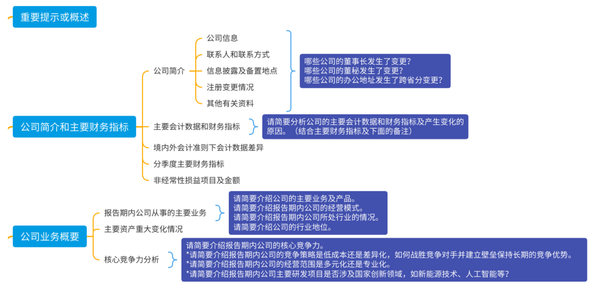

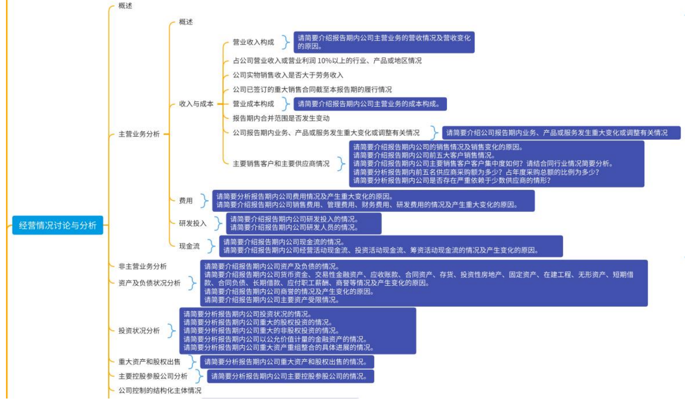

最终想要实现的QA系统问答能力应该如下：

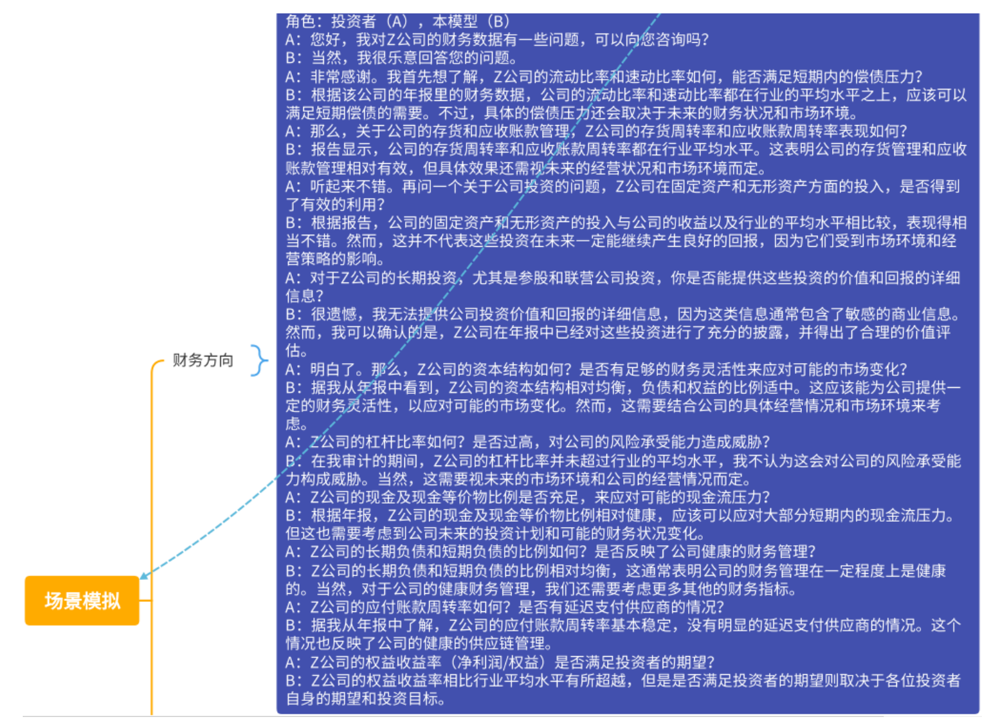

### 2、数据说明及常见模型部署方案


**知识库构成：**

包含 11588 份 2019 年至 2021 年期间的部分上市公司年度报告，共70G。

**评测方法：**

评测任务的任务形式为：给定一组参考文档和问题，要求模型按照指定格式生成答案，测试集大小为1000条，问题包含多种类型。

{"ID": 1,  
"question": "2020年招商银行利息净收入是多少元?",  
"answer":"2020年招商银行利息净收入为987654321.00元。"}

{"ID": 2,  
"question": "中国平安2021年的保险服务收入和投资收益分别是多少元?",  
"answer": "中国平安2021年保险服务收入为456789012.30元，投资收益为67890123.40元。"}

{"ID": 3,  
"question": "宁德时代2021年营业收入同比增长率是多少？保留2位小数。",  
"answer": "宁德时代2020年营业收入为50319500000.00元，2021年营业收入为130356000000.00元。根据公式，营业收入同比增长率=(本期营业收入-上期营业收入)/上期营业收入，计算得到宁德时代2021年营业收入同比增长率为159.09%。"}

### 3、评测指标

评测方法如下：

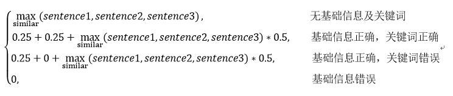

评测示例：

{
"question": "2021年贵州茅台营业收入是多少元?",
  "prompt": {
    "营业收入": "106190000000.00元",
    "key_word": "营业收入、2021",
    "prom_answer": "106190000000.00元"
  },
  "answer": [
    "2021年贵州茅台营业收入为106190000000.00元。",
    "贵州茅台2021年营业收入是106190000000.00元。",
    "贵州茅台在2021年的营业收入为106190000000.00元。"
  ]
}

评测计算示例：

输出结果：贵州茅台2021年营业收入是106190000000.00元。

most similar sentences:

贵州茅台2021年营业收入是106190000000.00元。 (Score: 0.9942)  
贵州茅台在2021年的营业收入为106190000000.00元。 (Score: 0.9865)  
2021年贵州茅台营业收入为106190000000.00元。 (Score: 0.9754)

评分：0.25 + 0.25 + 0.9942 * 0.5 = 0.9971 分。

评分解释：prom_answer 正确、包含所有 key_word、相似度最高 0.9942。

##### 另一个例子：

{"question": "2019年中国工商银行财务费用是多少元?",

"prompt": {"财务费用": "12345678.9元", "key\_word":"财务费用、2019", "prom\_answer": "12345678.9元"},

"answer": \[

"2019年中国工商银行财务费用是12345678.9元。",

"2019年工商银行财务费用是12345678.9元。",

"中国工商银行2019年的财务费用是12345678.9元。" ]

}

输出结果：工商银行2019年财务费用是12345678.9元。

most similar sentences:

2019年工商银行财务费用是12345678.9元。 (Score: 0.9915)

中国工商银行2019年的财务费用是12345678.9元。 (Score: 0.9820)

2019年中国工商银行财务费用是12345678.9元。 (Score: 0.9720)

评分：0.25+0.25+0.9915\*0.5=0.9958分。

评分解释：prom\_answer正确、包含所有key\_word、相似度最高0.9915。

### 4、项目挑战

1）**题型覆盖广、推理链差异大**  
测试集问题类型丰富，既包含可直接定位的事实查询，也包含需要跨表计算的指标推导，以及依赖多段文本归纳的分析类问题。不同题型对检索粒度、计算规则与推理方式的要求差异显著，单一框架或单一路径难以在准确率、鲁棒性与效率之间同时兼顾。

2）**年报数据形态复杂、结构化抽取难度高**  
上市公司年报以 PDF 为主，存在图文混排、跨页表格、合并单元格、注释脚注、口径差异与单位换算等问题，导致关键信息难以直接抽取为统一规范的结构化数据。若缺乏稳定的版面解析与表格恢复能力，将显著影响后续检索召回与计算准确性。

3）**缺少可用微调数据，标注成本高且质量难控**  
项目缺乏现成的高质量微调/监督数据集，完全依赖人工标注会带来高成本与长周期，同时还面临一致性（口径统一、答案格式统一）、覆盖性（题型与行业覆盖）、以及可泛化性（跨公司、跨年份、跨表字段）的质量控制难题。因此，需要设计更高效的数据构建机制，在有限投入下生成高质量、可复用的数据集。

4）**生成结果不稳定，输出规范与可控性不足**  
大模型在开放生成过程中存在表述波动、单位/精度不一致、计算过程缺失或冗余、以及未严格遵循指定 JSON/模板格式等问题，难以保证评测所需的“字段齐全、格式统一、可解析、可复现”。在以自动化评测为导向的场景下，必须提升生成可控性与格式约束能力，以稳定输出并降低评测误差与工程返工成本。

### 5、项目方案

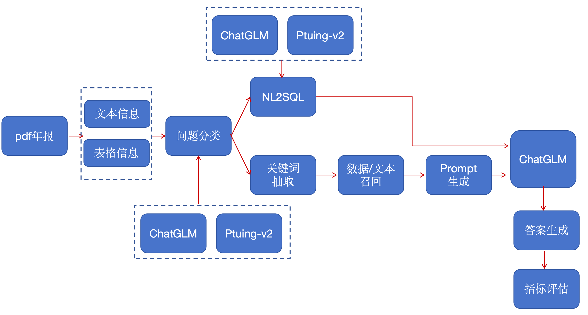

### 6、项目代码结构

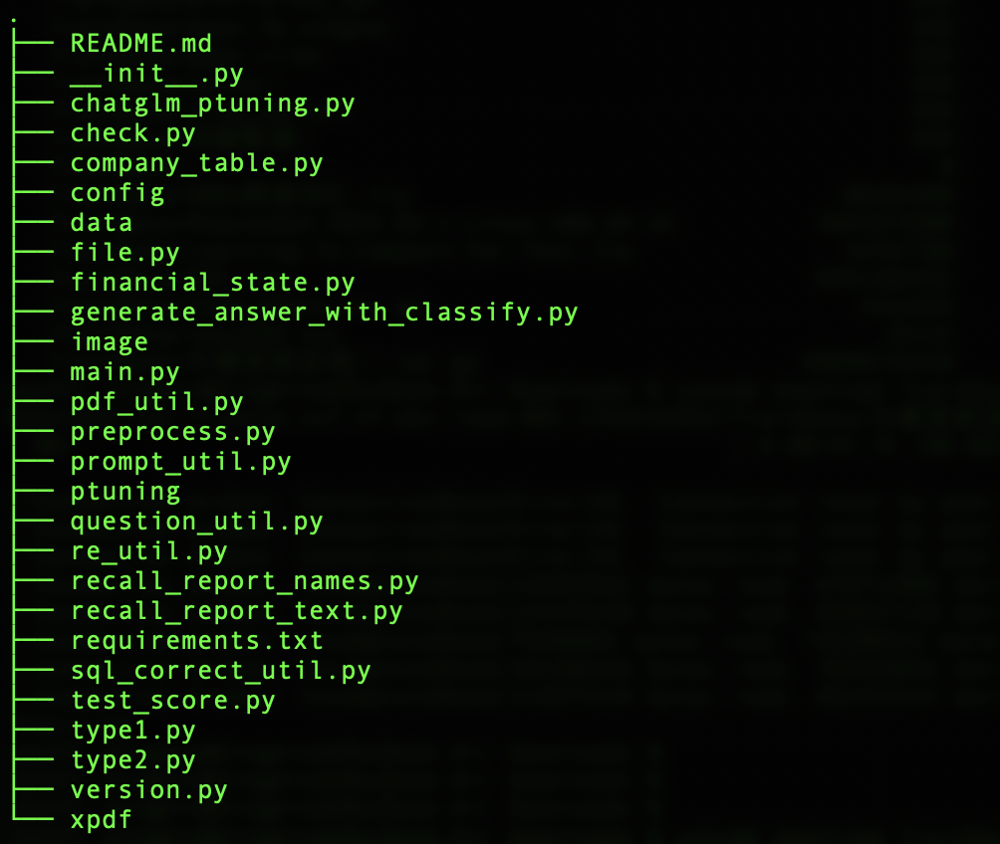

### 7、项目流程-PDF解析与信息抽取

年报中包含大量结构化表格信息（如资产负债表、利润表、现金流量表及其附注等）。为了支撑后续的指标查询与计算类问答，需要将这部分表格数据从 PDF 中稳定抽取出来，并落地到关系型数据库中，形成可检索、可计算的标准化数据底座。

###### 在工程实现上，通常先对年报 PDF 做格式转换与内容解析，再基于 TXT/HTML/DOCX 或 OCR 识别的中间结果抽取表格与关键字段。为提升后续查询效率并降低跨表关联的复杂度，本项目将结构化数据（表格数据与公司基础信息）进行统一建模，按“**每家公司一行**”汇总为一张**大宽表**，从而在问答阶段尽量通过单表条件过滤与字段取值完成查询，减少多表 join 和跨表口径对齐的工程成本。

###### 解析与抽取流程

* **PDF 文本抽取**：使用 `pdf2text` 工具提取正文文本，作为页级召回与定位依据

* **页面召回**：围绕报表名称/标题设置关键词（如“合并资产负债表”“合并利润表”“合并现金流量表”等），定位目标报表所在页（含跨页范围）

* **表格识别与提取**：使用 `camelot-py` 对目标页进行表格抽取（以图像/版面解析方式恢复表格结构与单元格内容）

* **信息过滤与口径筛选**：对抽取结果进行规则过滤与清洗，剔除或降权处理以下内容：
  
  * 非合并报表（如母公司报表）
  
  * 调整报表/更正报表/补充披露版本
  
  * 与目标字段无关的附表、注释段落等

上述 PDF 信息解析与抽取的实现代码集中在 `preprocess.py` 中。

**主要代码：**

def extract\_pdf\_text():       提取文本信息

def extract\_pdf\_tables()： 提取表格信息， 包括基本信息，雇员信息，研发人员表，合并资产负债表，合并利润表，合并现金流量表

表格提取过程如下：

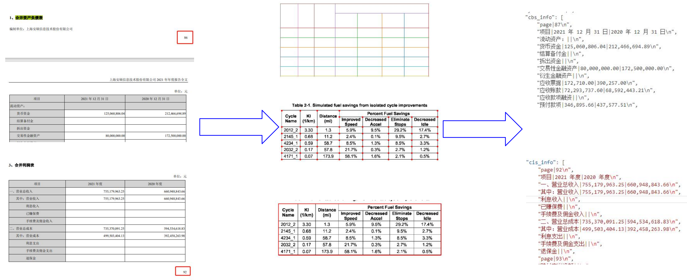

### 8、项目流程问题分类

大模型想要答得准，前提是得听得懂。我们需要根据用户意图的不同，把问题分门别类地处理。这可以通过微调一个模型来打造自动化的“**问题路由器**”，步骤很简单：

1. **造数据**：先用少样本（In-context Learning）让模型生成一批数据，再人工把把关。

2. **练模型**：用这些数据通过LoRA或P-Tuning等方法进行微调，训练出一个专门懂分类的模型。

3. **用模型**：直接把用户的问题丢给它，让它像做单选题一样，直接告诉你属于哪一类。

所谓问题分类，就是把文本归纳到预先设定好的框框里。构建相关模板的操作如下：

* **确立标签**：第一步要把类别定义清楚。这些类别是根据具体任务需求设计的。以下是基于数据梳理出的分类清单：

| 字母分类编号 | 分类选项名称   | 分类描述                  |
| ------ | -------- | --------------------- |
| A      | 公司基本信息   | 可以通过检索【公司基本信息表】来获取结果  |
| B      | 公司员工信息   | 可以通过检索【公司员工信息表】来获取结果  |
| C      | 财务报表相关内容 | 可以通过检索【财务三大报表】来获取结果   |
| D      | 计算题      | 需要根据问题类型检索计算因子来完成计算   |
| E      | 统计题      | 需要根据问题类型分析条件检索来获取结果   |
| F      | 开放性问题    | 根据问题关键词来检索全文相关匹配来回答问题 |

- 问题选项强化描述，增强AI对问题选项的理解，如加入分类的描述，分类相关的关键词等。以下是构造的问题分类的prompt：
  
  > ### A 类：公司基本信息（可在“公司基本信息表/年报公司概况”直接查到）
  > 
  > * 示例 1：**“中信证券2021年的法定代表人是谁？”**
  > 
  > * 示例 2：**“宁德时代2020年的注册地址在哪里？”**
  > 
  > * 示例 3：**“隆基绿能2019年公司网址是什么？”**
  > 
  > ### B 类：公司员工信息（可在“员工信息表/人力资源情况”直接查到）
  > 
  > * 示例 1：**“海康威视2021年在职员工总数是多少人？”**
  > 
  > * 示例 2：**“比亚迪2020年研发人员数量是多少？”**
  > 
  > * 示例 3：**“贵州茅台2019年本科及以上学历员工占比是多少？”**
  > 
  > ### C 类：财务报表字段查询（资产负债表/利润表/现金流量表直接取值）
  > 
  > * 示例 1：**“中国建筑2021年期末货币资金是多少元？”**（资产负债表）
  > 
  > * 示例 2：**“美的集团2020年营业成本是多少元？”**（利润表）
  > 
  > * 示例 3：**“招商银行2019年经营活动产生的现金流量净额是多少元？”**（现金流量表）
  > 
  > ### D 类：计算题（年报中没有现成结果，需要按公式计算）
  > 
  > * 示例 1：**“格力电器2021年资产负债率是多少？保留2位小数。”**  
  >   （资产负债率=负债合计/资产总计）
  > 
  > * 示例 2：**“万科A2020年毛利率是多少？保留2位小数。”**  
  >   （毛利率=(营业收入-营业成本)/营业收入）
  > 
  > * 示例 3：**“中国平安2021年每股收益(EPS)是多少？保留2位小数。”**  
  >   （EPS=归属于母公司股东的净利润/期末总股本或加权平均股本，视口径要求）
  > 
  > ### E 类：统计题（需要筛选/聚合/排序等统计操作，往往涉及多公司或多条件）
  > 
  > * 示例 1：**“在2019—2021年间，研发费用连续增长的公司有哪些？列出公司名称。”**
  > 
  > * 示例 2：**“2021年净利润排名前10的公司是谁？按净利润从高到低输出。”**
  > 
  > * 示例 3：**“筛选2020年资产负债率低于50%的公司数量，并给出公司名单。”**

- 构建模板：根据问题集的问题遍历提取用户提问，为每个类别构建一个模板或规则集，以便根据问题文本分类到正确的类别中。

**问题分类流程：**

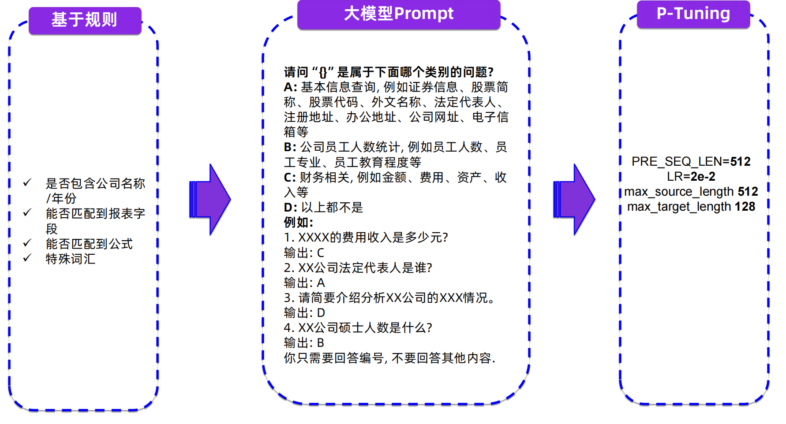

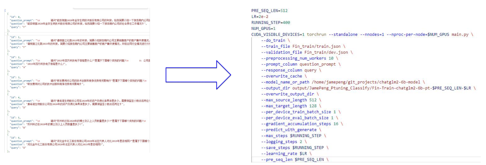

**结果示例：**

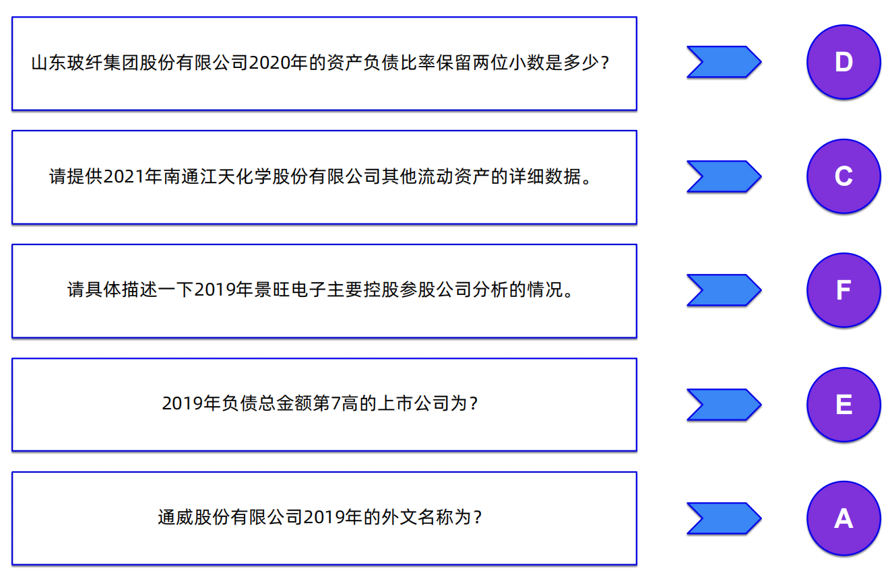

**主要代码：**

模型微调：&#x20;

./ptuning/CLASSIFY\_PTUING/train.sh

在线预测：

main.py: Line 86\~L88

generate\_answer\_with\_classify.py: def do\_classification()

### 9、项目流程-SQL生成

NL2SQL 的微调训练，核心工作仍然是**训练数据集的构建**。需要强调的是，数据集应当面向**真实业务的查询场景**来设计，而不是直接套用 Spider 这类通用 NL2SQL 数据集，否则会出现字段口径不匹配、问法分布不一致、落地效果差等问题。实践中常见的构造方式主要有两类：

1. **基于 SQL 模板自动生成数据**：通过预设 SQL 模板批量生成“问题-SQL”对，但由于模板空间有限，问题表达与查询模式较固定，整体泛化能力相对不足。

2. **基于问答模板 + 随机填充 + 大模型改写**：先构建一套 SQL 问答模板，对公司、年份、指标、筛选条件等槽位进行随机填充，再借助 ChatGPT 等大模型对自然语言问题进行多样化改写，从而形成更贴近真实用户问法的训练数据，通常效果更佳。

无论采用哪种方式，生成的数据都必须经过**人工审核**。对于微调而言，**数据质量的重要性远高于数量**：口径一致、字段准确、SQL 可执行、答案可验证，往往比扩大样本规模更能提升最终效果。

为了让模型生成更正确的 SQL 并返回准确结果，可以总结为三条实践经验：

1. **采用“一张大宽表”建模**：尽量将常用指标与基础信息汇总到单表，避免复杂 join，使 SQL 更短更直观，从而显著提高生成成功率。

2. **在 Prompt 中显式约束字段**：明确告知可用表名与字段名，减少模型“臆造字段”的概率；字段定位可结合前文的关键词匹配/字段别名词典来完成。

3. **计算类问题优先拆分处理**：遇到比率、增长率等计算需求（如营业利润率=营业利润/营业收入），建议拆成多个简单查询分别取数，再在程序侧按公式计算，降低 SQL 生成复杂度并提升准确性。

NL2SQL 的本质是将自然语言查询转化为 SQL，以便从数据库中获取信息。围绕“模板化构建”，可按以下步骤组织：

* **定义查询类型**：覆盖查询、排序、区间/范围输出、计数、求和，以及单字段/多字段检索、多条件过滤等常见执行需求。

* **示例对话对齐意图**：通过让大模型扮演 MySQL 开发人员，提供“自然语言—SQL”的示例对话，帮助模型建立指令理解与映射模式。

* **提供数据库结构信息**：输入表名与字段清单，确保数据已完成清洗与合并，同类字段具备一致口径与可用性。

* **生成 SQL 语句**：依据 SQL 语法结构（语法树/模板规则）组合出可执行的查询语句。

* **参数与实体替换**：将问题中的实体与条件（如公司名、年份、指标名称、筛选条件）映射替换为数据库中真实存在的字段与取值，形成最终可执行 SQL。

> 📌role\_prompt = '''
> 
> 你是一名Mysql数据库开发人员，你精通Mysql数据库的sql代码编写，你需要根据已知的表名、字段名和用户输入的问题编写sql代码
> 
> 已知表名：company\_table
> 
> 已知字段名：\[公司全称、年份、经营活动现金流入小计、公司的中文简称、固定资产...]
> 
> 注意对问题中的中文数字（xx亿、xx千万、xx万）进行阿拉伯数字转换，如：一个亿、一亿需转换为100000000，一千万需转换为10000000
> 
> 要求sql代码中的字段名必须是已知字段名，不得新增字段名
> 
> 示例模板：
> 
> """
> 
> 用户输入：2019年哪家公司的负债合计最高？
> 
> sql如下：
> 
> \`\`\`
> 
> select 公司全称 from company\_table order by 负债合计 and 负债合计 is not null desc limit 1\`\`\`
> 
> 用户输入：在上海注册的上市公司中，2019年谁的负债合计最高？金额是？
> 
> sql如下：
> 
> \`\`\`
> 
> select 公司全称, 负债合计 from company\_table where 注册地址 LIKE '%上海%' and 年份 = '2019' order by 负债合计 and 负债合计 is not null desc limit 1 \`\`\`
> 
> """
> 
> 请根据以下用户输入，输出sql代码。
> 
> 用户输入：
> 
> '''

> 📌question\_prompt = role\_prompt + question

**NL2SQL基本流程：**

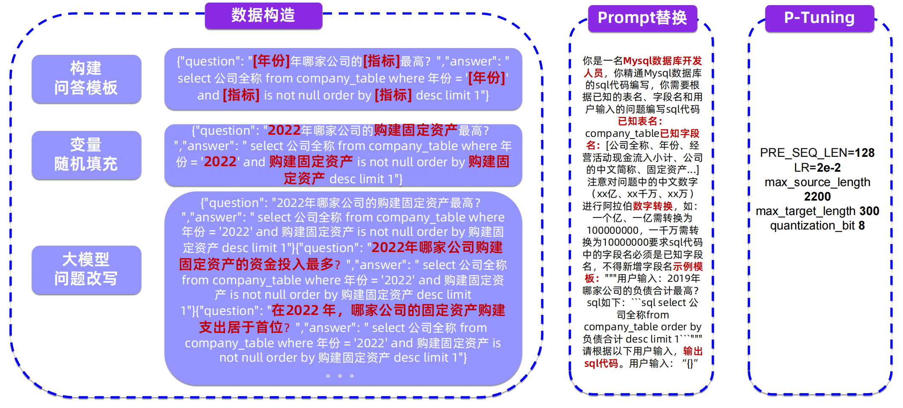

**NL2SQL结果示例：**

2019年负债总金额第7高的上市公司为？

```纯文本
 SELECT 公司全称 FROM company_table WHERE 年份 = '2019' AND 负债合计 IS NOT NULL ORDER BY 负债合计 DESC LIMIT 1 OFFSET 6
```

2020年其他流动资产最高的前三家上市公司是哪些家？

```纯文本
 SELECT 公司全称 FROM company_table WHERE 年份 = '2020' AND 其他流动资产 IS NOT NULL ORDER BY 其他流动资产 DESC LIMIT 3
```

2020年营业总收入最高的7家并且曾经在武汉注册的上市公司是？金额是？

```纯文本
 SELECT 公司全称, 营业总收入 FROM company_table WHERE 年份 = '2020' AND 注册地址 LIKE '%武汉%' AND 营业总收入 IS NOT NULL ORDER BY 营业总收入 DESC LIMIT 7
```

哪家上市公司2019年总负债最低？

```纯文本
SELECT 公司全称 FROM company_table WHERE 年份 = '2019' AND 负债合计 IS NOT NULL ORDER BY 负债合计 ASC LIMIT 1
```

哪家在上海注册的上市公司，2020年营业收入最高？金额是？

```纯文本
SELECT 公司全称, 营业收入 FROM company_table WHERE 年份 = '2020' AND 注册地址 LIKE '%上海%' AND 营业收入 IS NOT NULL ORDER BY 营业收入DESC LIMIT 1
```

**主要代码：**

模型微调：

./ptuning/NL2SQL\_PTUING/train.sh

在线预测：

main.py: Line 96\~98

generate\_answer\_with\_classify.py: def do\_sql\_generation()

### 10、项目流程-关键词抽取

很多业务场景中，我们需要借助 **Prompt** 引导大模型从用户问题里**抽取关键词**。

例如，通过识别问题中的关键词，可以更准确地理解用户意图，再按照预设规则选择对应的处理路径与回答方式。但在金融等专业领域，如果使用 ChatGLM2-6B 这类通用模型时，出现对专业术语理解不足、关键词抽取不稳定或不准确的情况，就可以进一步**微调一个专用的关键词抽取模型**，专门用于从用户提问中提取领域关键词与关键槽位信息。

在实际系统中，也可以采用“关键词模型 + 检索”的组合策略：先用关键词模型对用户问题进行**压缩总结与关键信息提取**，再把这些关键信息向量化，进行向量检索来匹配标准化关键词集合或领域词表。通过这种方式，不仅可以提升检索召回与匹配准确率，还能进一步用于**定位数据库表字段**——即把用户表达映射到库表中的标准字段名，减少后续 NL2SQL 或规则解析的歧义与错误。

关键词抽取任务的目标是从文本中提取最能代表主题与关键信息的词或短语，为后续检索与结构化处理提供输入。关键词越精准，后续匹配到的信息通常越可靠，最终回答也更稳定。围绕关键词抽取任务，可按如下流程构建模板与数据：

* **设计关键词抽取 Prompt**：需要反复调试 Prompt 的稳定性与可控性。在不做微调的情况下，通过 few-shot 示例也能达到可用效果。本项目采用的 Prompt 形式如下：  
  `role_prompt = '''请帮我从以下句子中提取关键词。这些关键词是句子中最重要、最能概括句子主题的词汇。通过这些关键词，你可以更好地理解句子的内容。你只需要回答文本中的关键词，不要回答其他内容. 用户输入：'''`  
  `question_prompt = role_prompt + question`

* **收集示例文本**：整理覆盖不同典型题型与关键词类型的代表性问题样本，确保包含公司、年份、指标名称、口径约束、统计/计算要求等关键元素的多样表达。

* **构建训练模板与数据集**：遍历问题集，将用户提问按照统一格式拼接为 prompt 输入，形成“输入—输出（关键词列表）”的训练样本；后续可结合人工校验，保证关键词口径一致、边界清晰、可映射到词表/字段。

**构造的数据如下所示：**

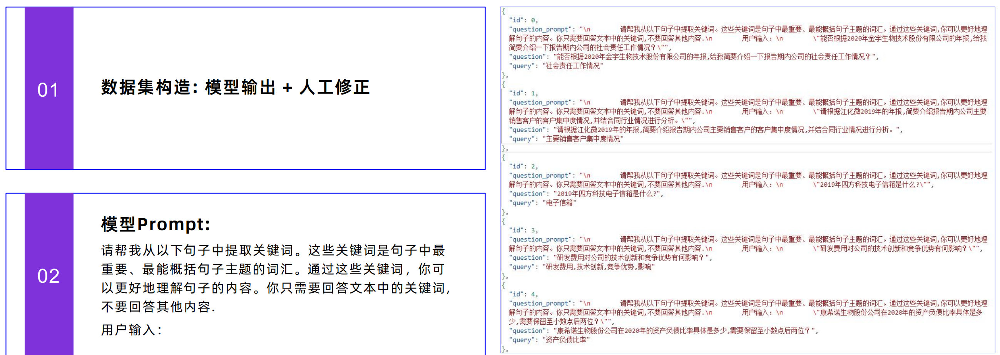

**输出结果示例：**

**Question:** 请给出上海电气股份有限公司在2021年的研发人员数量（给出具体人数）。  
**Keywords:** 研发人员数量

* * *

**Question:** 请简要说明2020年*ST康得新面临的退市风险/退市相关进展情况。  
**Keywords:** 退市风险情况

* * *

**Question:** 2021年恒瑞医药的“应收票据及应收账款”期末余额是多少元？  
**Keywords:** 应收票据及应收账款

* * *

**Question:** 在2020年度，中国中铁的流动比率是多少？  
**Keywords:** 流动比率

* * *

**Question:** 2021年海螺水泥的投资收益和归母净利润分别是多少元？  
**Keywords:** ‘投资收益’，‘归母净利润’

**主要代码：**

模型微调：

./ptuning/KEYWORDS\_PTUING/train.sh

在线预测：

main.py: Line 91\~93

generate\_answer\_with\_classify.py: def do\_gen\_keywords()

### 11、项目流程-答案生成

**主要代码：**

main.py: Line 101\~102

generate\_answer\_with\_classify.py: def generate\_answer()

type1问题处理流程（基本信息类）:

**处理流程：**

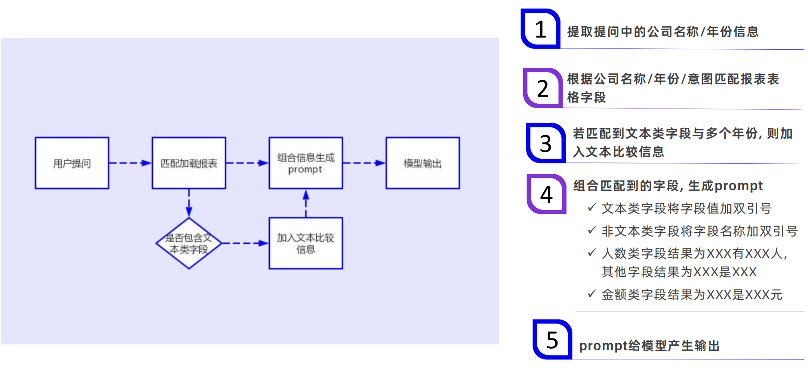

**回答示例：**

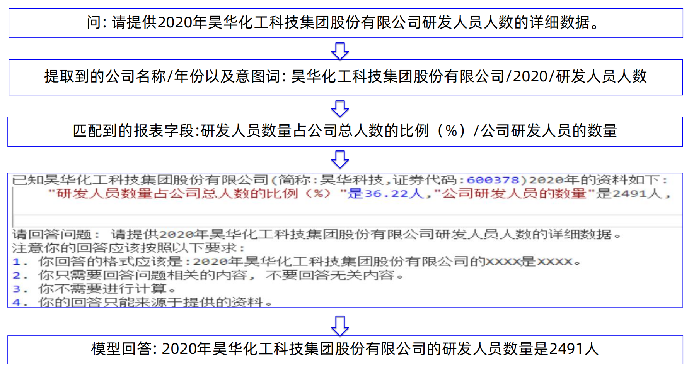

type2问题处理流程（统计计算类）:

**处理流程：**

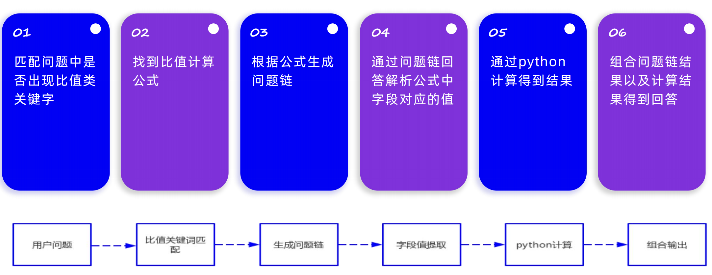

**回答示例：**

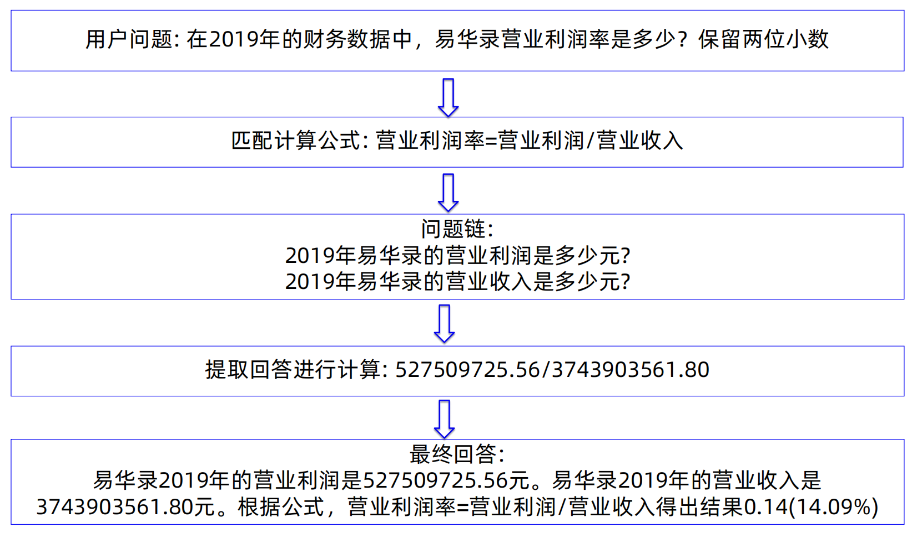

type3问题处理流程（总结推理类）:

**处理流程：**

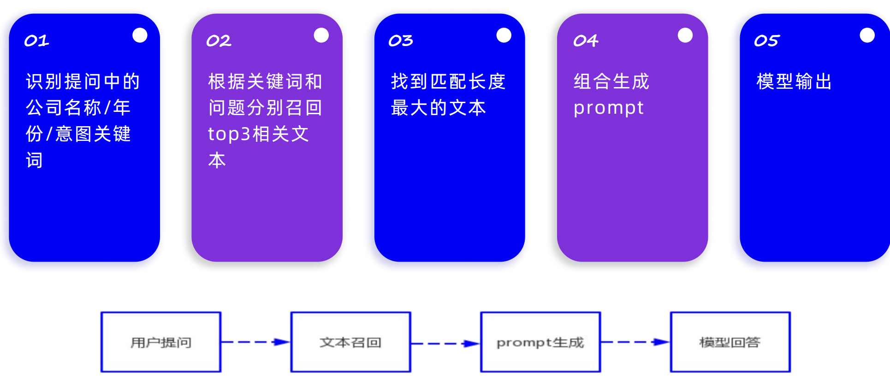

**回答示例：**

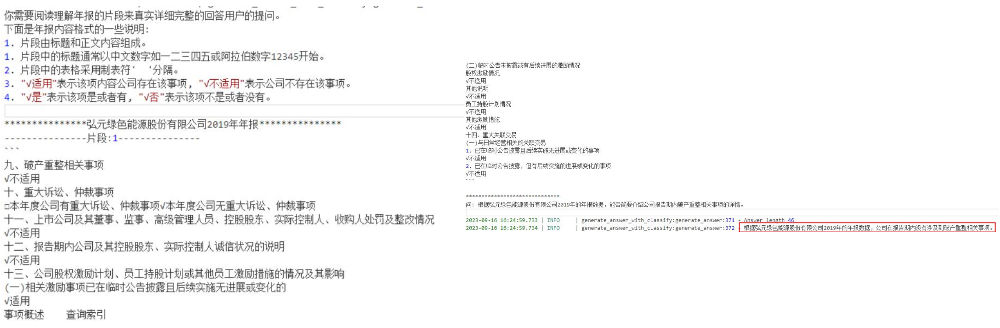

### 12、项目总结

#### **Prompt设计**：

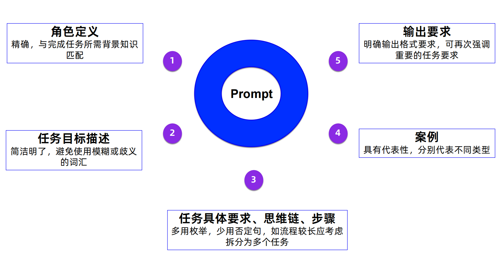

#### **模型微调：**

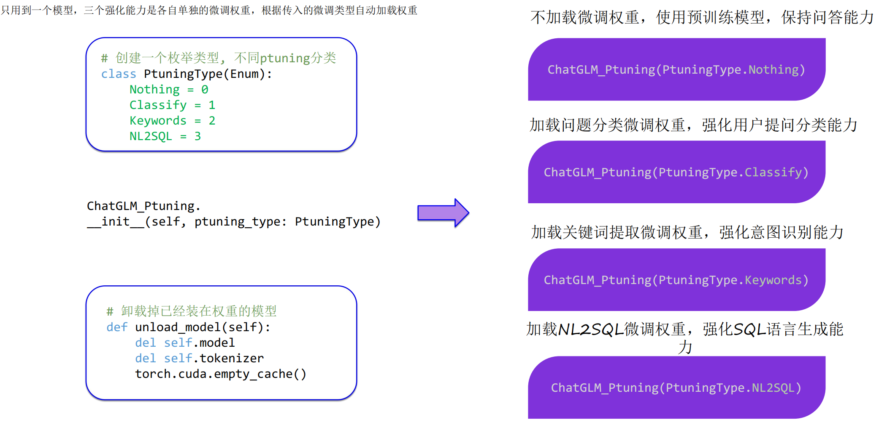

#### 微调的重要事项，以及如何解决常见问题

构造训练集的注意事项
----------

1. **数据准备**：训练数据应尽量保证高质量与多样性。数据本身的可靠性与覆盖面，往往对模型最终表现起决定性作用。

2. **数据清洗**：微调前需对数据进行清洗处理，包括剔除噪声、纠错错误标签、消除前后矛盾或口径不一致的样本。考虑到 6B 级模型能力有限，建议尽可能去除干扰项（如无关格式片段、冗余文本等），降低学习难度。

3. **数据平衡**：在二分类等任务中，应关注正负样本分布的均衡性。类别比例过度偏斜往往会造成模型偏置，导致整体性能下降。

4. **数据增强**：可借助 OpenAI GPT-4 等更强模型扩大训练数据的语言表达多样性，例如：同一问题的不同表述方式、不同语气与敬语、不同信息组织顺序、金融术语的同义替换、同一问题中金融名词出现数量的变化等。实践中可对每一类问题扩增约 20–40 条，以提升模型对不同输入风格的泛化能力。

5. **样本筛选**：应根据具体任务特征挑选具有代表性的样本进入训练集，优先保证覆盖典型场景与关键边界情况，从而提升整体训练效果。

* * *

训练过程中的注意事项
----------

1. **超参数设置与调优**：需要合理选择学习率、批量大小等关键超参数。
   
   * 可采用学习率调度策略以促进收敛稳定性。P-Tuning v2 的默认学习率为 2e-2，实际可从 1e-2 起逐步向下尝试；同时 1e-5 与 5e-5 也是较常见的初始学习率参考点。
   
   * `PRE_SEQ_LEN` 与 `max_source_length` 应与训练集中的最大输入长度（如 `max(question_prompt)`）保持匹配：设置过小会导致输入被截断，设置过大则会显著增加训练耗时。建议尽量取 8 的倍数，例如 128、256、512、1024、2048。
   
   * `max_target_length` 只需覆盖合理输出范围即可。本次任务（问题分类与关键词提取）通常设置为 256 即可满足需求（仍需结合任务实际输出长度确认）。
   
   * 在默认配置 `quantization_bit=4`、`per_device_train_batch_size=1`、`gradient_accumulation_steps=16` 下，INT4 量化模型参数被冻结；训练时以 batch=1 连续进行 16 次梯度累加的前后向传播，等效总 batch size 为 16，此时最低显存需求约 6.7GB。不使用 `quantization_bit=4` 时显存占用约为 15.7GB。若希望在等效 batch size 不变的前提下提高训练效率，可适当增大 `per_device_train_batch_size` 并相应减小 `gradient_accumulation_steps`（保持二者乘积不变），但会带来更高显存开销，需要按资源条件权衡。

2. **训练监控与问题定位**：建议持续记录并观察训练过程指标，如 loss、accuracy、precision、recall 等，以便及时发现异常并快速定位原因。
   
   * 若训练过程中某些 step 的 loss 突然升高，常见原因包括：训练集中存在互相矛盾的标注、错误标注，或同一类问题出现了不一致的标注规范（在关键词提取任务中尤为常见）。
   
   * 在 300 step 以内 loss 往往难以降至理想水平（项目目标设定为 0.02 以下）。当 loss 长期无法下降时，通常意味着训练集中仍存在一定比例的标注错误。可使用当前微调权重执行 evaluate，并检查 `generated_predictions.txt`，重点排查输出不稳定或明显偏离的样本。
   
   * 也可利用 matplotlib 将训练日志 `trainer_state.json` 中的 loss 曲线可视化，辅助判断收敛趋势与异常点。

3. **过拟合处理**：若出现过拟合现象，通常是样本规模偏小导致。可尝试将单类任务的训练样本量提升到约 200 条左右，以缓解拟合过度问题。

4. **分布式训练**：在数据规模较大或训练成本较高的情况下，若计算资源允许，可考虑采用分布式训练以提升训练吞吐并缩短整体训练时间。

项目经验
---------

* **面向年报场景构建金融对话交互系统**：围绕“年报问答—指标计算—开放分析”三类需求，设计从问题理解、检索召回、结构化取数、计算与归纳生成的端到端链路，支持稳定的 JSON/模板化输出。

* **多任务适配能力沉淀**：将大模型能力拆解为可复用的 NLP 子任务组件（问题分类、关键词抽取、实体标准化、字段映射、NL2SQL、答案生成与格式校验），实现按题型编排的“路由式”处理。

* **指令遵循 + Few-shot Prompt 工程**：针对专业金融术语与指标口径，构造示例库与约束型 Prompt（字段白名单、单位与精度规则、输出格式约束），显著降低自由生成带来的不可控风险。

* **行业场景复杂度评估与分层治理**：识别 ToB 金融问答相较通用对话的差异（口径、精度、可追溯、合规、容错），采用“多模型 + 多工具”的组合架构而非单模型全包。

* **6B 模型幻觉抑制策略**：通过检索证据绑定、字段白名单、数值校验、模板化输出与拒答策略，降低“编造字段/编造数值/单位错配”等典型幻觉。

* **小样本微调策略选择**：在数据规模有限的场景下优先采用参数高效微调（如 P-Tuning v2/LoRA 的策略评估），以较低成本增强分类与抽取类任务的稳定性。

* **数据质量优先的训练集构建流程**：建立“模板生成→大模型改写→人工抽检/复核→自动一致性校验”的闭环，明确质量指标（字段可映射、SQL可执行、答案可验证、单位精度一致）。

* **规则优先的字段映射体系**：构建领域关键词词典、指标别名体系（同义词/简称/口语表达）、公司实体标准化（简称↔全称↔证券代码），用于 schema linking 与路由判定的稳定落地。

* **结构化底座：年报表格抽取与宽表建模**：将三大表与公司基础信息统一清洗入库，按“公司-年份”汇总成大宽表，显著降低跨表 join 的复杂度并提升 NL2SQL 命中率。

* **PDF 表格抽取工程化**：针对跨页表、合并单元格、注释/脚注干扰、单位换算等问题，设计“页召回→表格识别→口径筛选→字段对齐→数值归一化”的流水线，提高抽取准确率与可维护性。

* **题型驱动的 SQL 生成与执行**：将 SQL 需求归类为单字段查询、多字段查询、条件过滤、排序TopN、聚合统计（count/sum/avg）、范围输出等，分别配套模板与语法树约束，降低自由生成 SQL 的错误率。

* **计算类问题拆解执行**：对增长率、比率、同比/环比等问题采用“拆分取数→公式计算→结果复核”的策略（例如利润率、资产负债率），避免生成复杂 SQL 导致的逻辑错误。

* **数值与单位规范化**：统一处理“元/万元/亿元”、千分位、括号负数、精度保留（2位小数/百分比）等规则，并在输出阶段做二次校验，提升评测友好性与可比性。

* **答案可追溯性设计**：对每次回答保留证据片段（来源页、表名、字段名、SQL、计算公式与中间值），支持审计与排错，满足金融场景“可解释/可复核”要求。

* **格式与可解析输出约束**：通过 JSON schema/正则校验/强制模板，将回答控制在评测可解析范围内，避免“多余解释、字段缺失、格式漂移”导致的评测扣分。

* **评测对齐与策略优化**：基于相似度评分、关键词覆盖、prom_answer 命中等评测规则，反向优化输出策略（关键词必须出现、答案句式控制、数值优先输出），提升自动评测分数稳定性。

* **错误分析体系**：建立错误类型标签（字段映射错误、口径混淆、单位错误、年份/公司解析错误、SQL 语法错误、计算公式错误、输出格式错误），推动针对性修复与数据回流。

* **缓存与性能优化**：对“公司-年份-字段”的高频查询引入结果缓存/SQL缓存，对检索向量索引做热数据加载，提升并发与响应时延表现。

* **鲁棒性与降级策略**：当结构化取数失败时，自动切换到“全文检索+证据生成”；当证据不足时触发拒答或澄清；对异常值（0、缺失、负数）设定防呆规则。

* **安全与合规意识**：对敏感信息、推断性结论与投资建议边界进行约束（仅基于年报披露内容回答、避免直接给出投资建议），适配金融场景风控要求。

* **工程可维护性**：将 Prompt、词典、模板、字段映射、公式库配置化，支持快速迭代与版本管理；对抽取与问答链路输出结构化日志，便于定位问题。

* 其他常用经验：

* 1. **通用能力可复用到多类 NLP 任务**  
     将大模型作为“通用语义引擎”，覆盖文本分类、意图识别、实体/字段抽取、结构化生成（如 SQL/JSON）等任务，并通过组件化封装实现跨场景复用与快速迁移。
  
  2. **指令遵循与示例学习能力工程化落地**  
     通过指令约束（输出模板、字段白名单、单位精度规则）+ few-shot 示例库，稳定控制模型行为；对“同一意图多种问法”实现一致输出，降低线上漂移。
  
  3. **ToB 金融场景复杂度显著高于 ToC，必须采用“多工具链路”**  
     企业金融问答涉及口径、审计、合规、可解释与可追溯，单一模型难以兼顾准确率与稳定性；采用“分类路由 + 检索/数据库 + 计算模块 + 生成与校验”的多模块协同架构更符合工程最优解。
  
  4. **小模型（6B）幻觉更突出，需要“约束 + 证据绑定 + 微调”组合治理**  
     针对 6B 模型易出现的“编造字段/数值/单位”的问题，通过证据绑定（SQL 结果/表格证据）、严格模板化输出、以及面向任务的轻量微调，有效提升可靠性与一致性。
  
  5. **微调效果的关键在“标注一致性与口径统一”，数据质量优先于规模**  
     在分类/抽取/NL2SQL 等任务中，高质量、强一致的数据对模型收益远高于堆量；重点控制字段边界、口径定义（合并/母公司、单位、保留位数）、以及同类样本的标注规范一致。
  
  6. **小样本也能显著增益（几百到几千条即可形成可观提升）**  
     当任务边界清晰（如分类、关键词抽取、字段映射），少量高质量样本即可带来明显稳定性提升，适合快速迭代与低成本上线试运行。
  
  7. **小样本场景优先采用参数高效微调（如 P-Tuning v2）**  
     在数据规模较小、算力受限或需要快速迭代时，优先选择参数高效方法获得更好的性价比；并结合量化与梯度累积，降低显存门槛与训练成本。
  
  8. **规则 + 正则的“高频问题快速通道”**  
     对数据库字段高频问法（如某年某指标）建立规则模板与正则抽取，形成高命中、低成本的快速通道，减少模型调用次数，提升吞吐与稳定性。
  
  9. **LLM 抽取关键词用于“长尾问法泛化与字段定位”**  
     在规则覆盖不足时，用 LLM 做关键词/槽位抽取（公司、年份、指标、口径），再映射到字段词典/向量检索，实现对相似问法的泛化处理，提升 schema linking 的召回。
  
  10. **混合式 QA 路由：精准问答走“结构化引擎”，非精准走“检索+生成”**  
      明确划分两条路径：
  * 精准取数类：NL2SQL → DB 执行 → 数值校验 → 模板输出
  
  * 解释归纳类：检索证据（年报段落）→ 归纳生成 → 引用与格式约束  
    该路由显著降低“用生成去做取数”带来的风险。
  11. **奥卡姆剃刀的工程原则：能规则解决就不微调，能小模型解决就不动大模型**  
      将成本、稳定性、可维护性纳入技术选型：优先规则化、其次小模型微调、最后才动用大模型生成，从而在企业环境中实现“可控、可审计、可扩展”。

* * *

行业启示
---------

1. **场景拆解优先于模型选择**：金融 ToB 应用的关键在于把业务问题拆成“可落地的原子任务”，先确定数据来源、口径、输出规范与评测方式，再决定是否需要微调以及选用何种模型。

2. **复杂问题要“任务编排”，而非“单次生成”**：高准确率往往来自“分类路由→检索/取数→计算→生成→校验”的链式流程。让模型只承担最擅长的环节，整体效果远好于一次性自由回答。

3. **数据质量是核心护城河**：在关键词抽取、分类、NL2SQL 这类任务上，高质量小样本（几百到两千条）经严格校验，往往比大量噪声样本更能带来稳定提升。

4. **结构化数据底座决定上限**：年报是典型“半结构化+表格密集”文档，若表格抽取与字段对齐不稳定，后续再强的模型也难以持续输出可信数值。

5. **宽表化能显著降低系统复杂度**：在以“公司-年份”为主键的查询场景中，大宽表能减少 join、提升 NL2SQL 成功率、降低公式计算的取数成本，是金融问答中非常实用的工程权衡。

6. **可控输出是金融系统的生命线**：金融场景必须强调格式、口径、单位、精度、可追溯。对输出的约束与校验（schema、正则、字段白名单、单位换算）往往比“更大模型”更重要。

7. **评测规则会反向塑造系统设计**：如果评测包含关键词覆盖、相似度与 prom_answer 命中，系统就应围绕“关键词必现、数值优先、句式稳定”进行策略化生成，而不是追求文采与长文本解释。

8. **“奥卡姆剃刀”在企业落地中更有效**：能用规则/配置解决的尽量不引入微调；能用小模型微调解决的尽量避免用更大模型；把大模型资源留给开放分析与复杂归纳环节。

9. **错误闭环比一次性效果更重要**：真正能持续提升的是“线上错误采样→标签与归因→数据回流→Prompt/词典/模板/微调迭代”的工程闭环，而不是单次调参。

10. **多模型协同是现实最优解**：关键词/分类适合小模型微调，取数靠数据库与规则，分析总结交给大模型生成；通过“分工协作”实现成本、性能与稳定性的平衡。

11. 其他相关启示：

12. * **行业场景先解构再建模，往往比“换更大模型”更有效**  
      核心前置工作是把业务问题拆成可执行的原子能力（分类、取数、计算、归纳、格式化、校验），很多“技术难题”在明确边界后可用工程手段快速解决。
    
    * **复杂问题的关键能力是“分解—编排—校验”，而非单轮生成**  
      将复杂问题拆成多个可验证的子问题，建立问题链路逐步求解；用“取数可验证、计算可复核、输出可解析”的方式提高整体正确率，而不是盲目依赖模型一次性回答。
    
    * **数据质量优先是底层共识，尤其在微调与结构化任务中更显著**  
      在训练集构建阶段必须保证一致性与准确性；高质量数据不仅提升模型效果，也提升评测稳定性与线上可控性，这一点在各类预训练大模型竞争中也被反复验证。
    
    * **金融问答的“第一性要求”是可追溯与可审计**  
      企业客户更在意：答案从哪来、口径是否一致、能否复算。能落地的系统必须把“证据链”和“血缘链”设计为一等公民。
    
    * **结构化底座决定上限：表格抽取、宽表/指标库与口径管理是主战场**  
      年报场景本质是“半结构化+表格密集”。只做文本检索很难在计算与数值问答上稳定达标；结构化抽取与指标库建设是长期价值更高的投入。

### 运行步骤

- **环境安装**

首先保证cuda, cudnn, pytorch-gpu的基本库是OK的，然后再安装requirements.txt的所需的第三方依赖。

后面在运行代码的过程中，根据某些缺失的个别包信息，再安装即可。

- **模型下载**

下载chatglm2-6b和Qwen1.5-7B模型，放到目录./data/pretrained_models/下。

数据：allpdf解压后，目录放到./data/下

- **模型微调**

如果想用lora微调，可以进入lora目录分别运行对应模型的训练，预测代码，下面以ptuing微调为例。

1.问题分类微调：

进入代码目录：cd ptuning/CLASSIFY\_PUTUNING

训练： bash train.sh

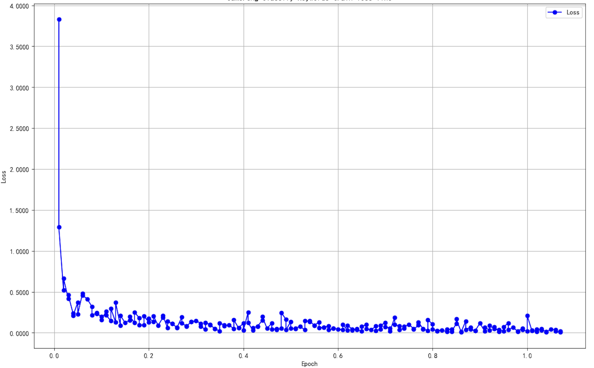

测试：bash evaluate.sh

观察指标预测情况，在output目录看看结果generated\_predictions.txt的输出，是否符合预期。

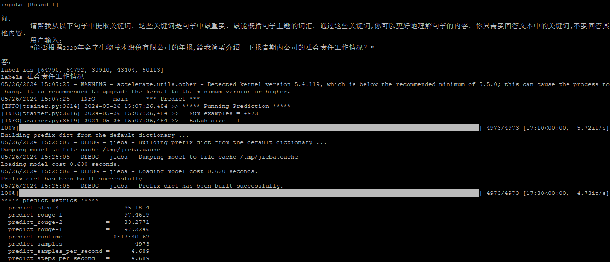

2.关键词抽取微调：

进入代码目录：cd ptuning/KEYWORDS\_PUTUNING

训练： bash train.sh

测试：bash evaluate.sh

观察指标预测情况，在output目录看看结果generated\_predictions.txt的输出，是否符合预期。

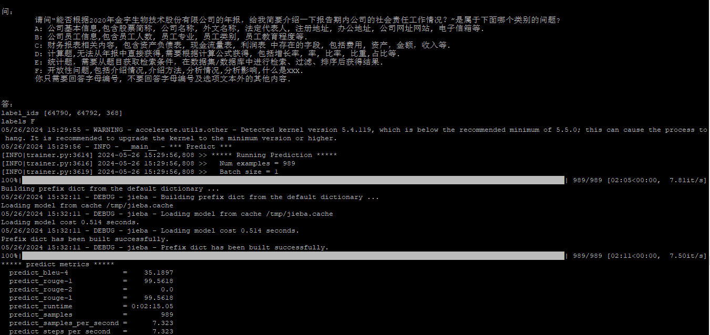

3.SQL生成微调：

进入代码目录：cd ptuning/NL2SQL\_PUTUNING

训练： bash train.sh

测试：bash evaluate.sh

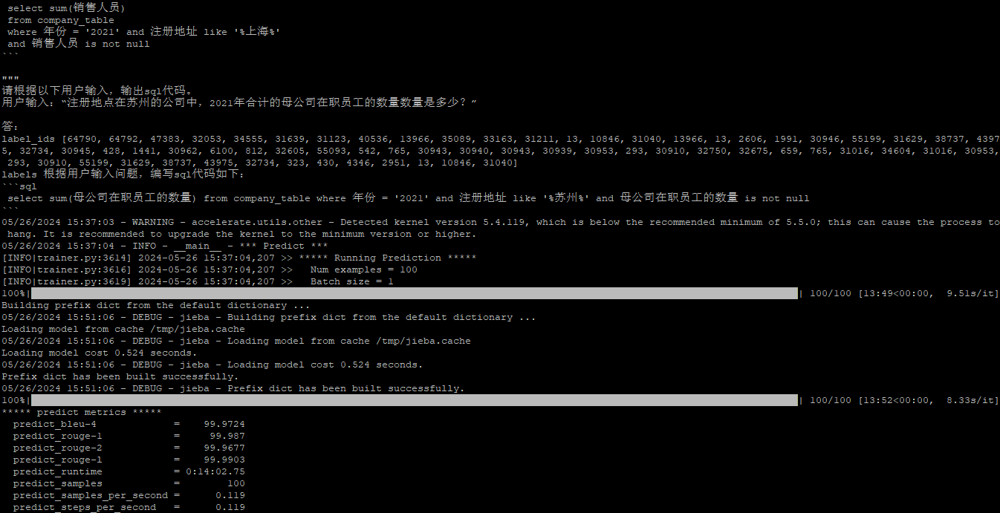

观察指标预测情况，在output目录看看结果generated\_predictions.txt的输出，是否符合预期。

- **主代码运行**

回到项目根目录：

修改config/cfg.py下的BASE\_DIR为自己的项目的绝对路径。

python main.py

运行时间会较长，可根据服务器的cpu核数，调整config/cfg.py下的NUM\_PROCESSES设置，利用并行计算，加速模型处理过程。

- **指标计算**

python test\_score.py

预测指标在：data/test/output.json，包括type1, type2, type3以及加权后的总得分。

> 📌{"success": true, "score": 85.2515, "scoreJson": {"type1Score": 88.605, "type2Score": 91.3155, "type3-1Score": 66.5395, "type3-2Score": 88.3592, "score": 85.2515}}

+++++++++++++++++++++++++++++++++++++++++++++++++++++++++++++

主要代码说明：

main.py

- 包含全流程, 数据下载/pdf表格提取/表格⽣成/问题分类/问题关键词提取/SQL⽣成/问答结果⽣成/提交⽣成

generate\_answer\_with\_classify.py

- generate\_answer函数对每类问题⽣成问答结果

问答结果⽣成
Type1：

核心处理代码：

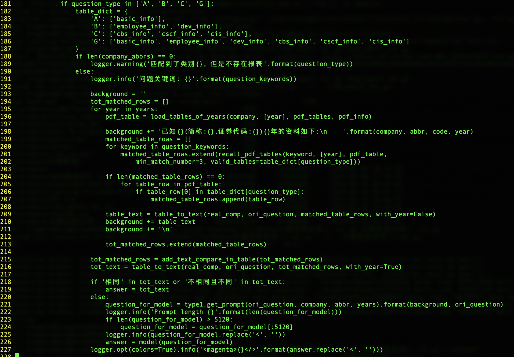

主要处理步骤:

1. 对于Type1每类问题, 从该问题对应的报表中根据关键词召回可能对应的⾏
2. 对于⾏为字符串类型的, add\_text\_compare\_in\_table实现对⽐不同年份的字段内容是否相同
3. 对于问题问是否相同的, 直接返回召回的报表
4. 对于其他的, 通过prompt组合召回的报表来传给模型进⾏回答, 具体prompt函数⻅type1.get\_prompt

Type2：

核心处理代码：

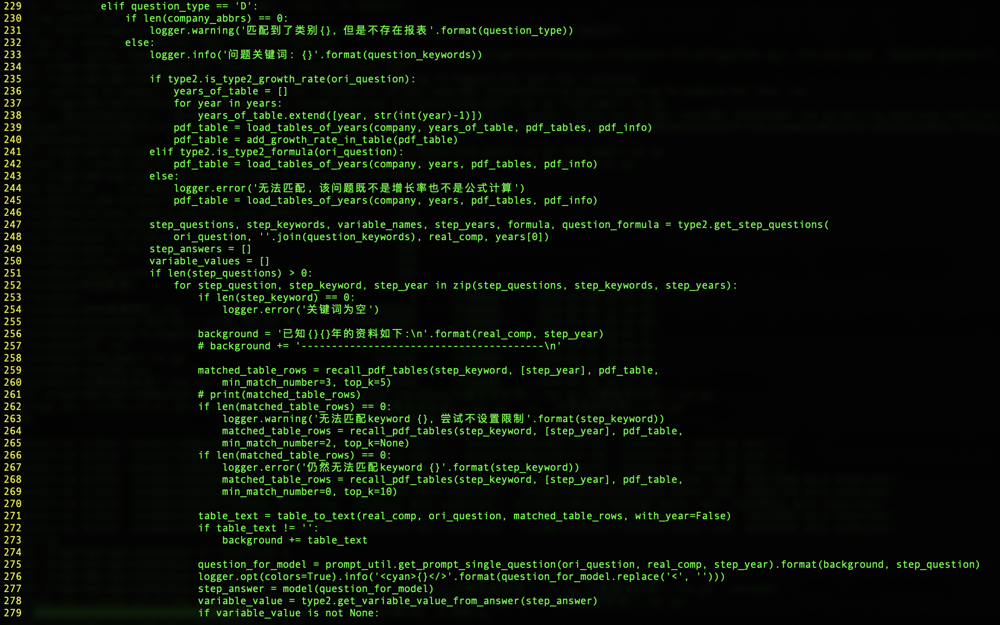

主要处理步骤:

1. 如果是计算增⻓率, 则需要召回前⼀年的数据

2. type2.get\_step\_questions将需要计算的内容转换为多个提问, 得到计算公式中的每个元素, 传给模型进⾏回答后, 提取数值作为公式的单元, 最后通过python计算该公式。
   a. 例如对于增⻓率, 公式为(A-B)/B, A表示当年的数值, B表示上年的数值
   b. 通过prompt\_util.get\_prompt\_single\_question⽣成针对A和B的提问
   c. 提取回答中的数值type2.get\_variable\_value\_from\_answer
   d. eval(formula)得到计算的结果

Type3：

核心处理代码：

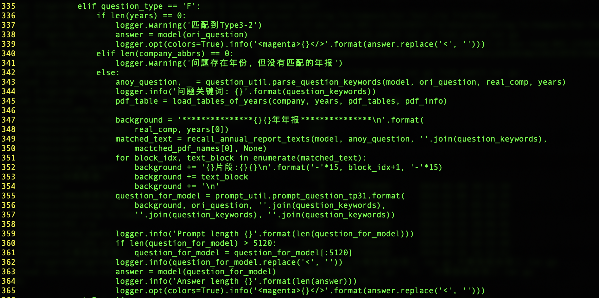

**系统处理链路概述：**

* 首先，对用户输入问题做关键词/槽位抽取：调用 `question_util.parse_question_keywords` 获取用于检索的核心信息。

* 随后进入证据召回阶段：由 `recall_annual_report_texts` 从年报文本中检索相关片段。实现上按行遍历 PDF 的解析文本，采用 BM25 分别对“关键词查询”和“原问题查询”进行检索，合并两组召回候选，并用“与原问题的字符匹配长度”作为匹配度指标对候选重新排序，最终保留匹配度最高的文本块。

* 最后，将该证据文本注入提示词模板：使用 `prompt_util.prompt_question_tp31` 组装 Prompt，提交给大模型生成回答。

+++++++++++++++++++++++++++++++++++++++++++++++++++++++++++++

### 14、项目改进

* **数据侧增强**：利用 GPT-4 / 文心一言等，通过提示工程扩充问题分类训练集至原规模的 2–3 倍，侧重 query 表达变化与同义改写，然后复训模型并对比性能。

* **微调策略替换实验**：在问题分类/关键词抽取/SQL 生成任一子模型上，借助 Llama-factory 将 P-Tuning v2 替换为 LoRA、GaLore，做对照实验评估测试集指标。

* **开放类问题召回升级**：对 F 类问题采用向量检索与 ES 的混合召回，返回 Top-k 文档；并对 bge、stella 等 embedding 模型做选型对比，评估对最终回答质量的影响。

* **推理加速评估（可选）**：基于 LoRA 的推理链路引入 FastLLM，加速后统计跑完全量测试集的总耗时与吞吐（QPS），与基线方案对比。

完成上述项目改进点，这些改进点都可以作为实战调优经验写进简历，上传改进后的项目代码到学习空间。
